 

JavaScript application allowing to see KML polygons on Google Maps

# 1. Launching application

In order to launch the application you need to have QR code reader application (for example QRDroid on Android). After scanning given QR code, URL will be decoded. After visiting such URL, you will have application opened in your browser:

# 2. GUI

GUI consist of:
- div, which loads Google Maps with polygons and markers:

 
  
- menu button, which opens menu:

 

- plus / minus button, if your phone does not support multitouch for zooming in / out:

## 2.1 Menu

### 2.1.1 Map type

We can select **A** - satelite map or **B** - road map:

### 2.1.2 Map view

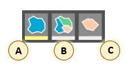

There are three available map views:
- **A** - territory view
- **B** - regions view
- **C** - region view

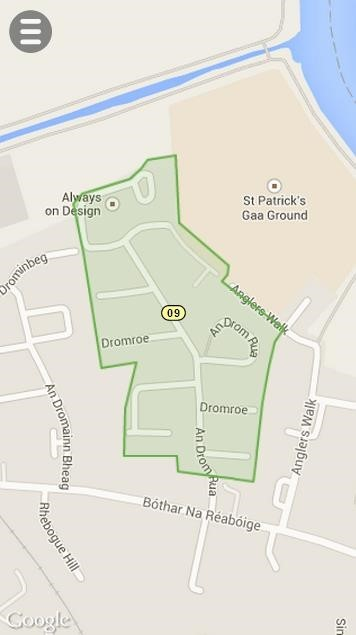

### 2.1.3 Information

*Information* button displays descriptions and types, distinguished by colors. The table on menu looks different for territory view:

and different for regions view:

### 2.1.4 Searching address

If we don't konw where on map there is some address we can use this function. Searched address should be written in the field visible below:

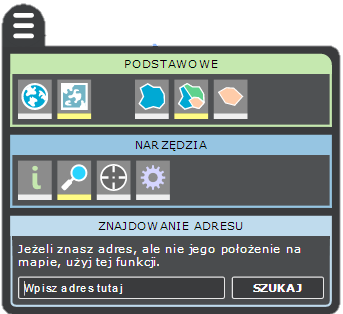

If searched address is found, menu will be closed and we will see marker together with a box as it is shown below:

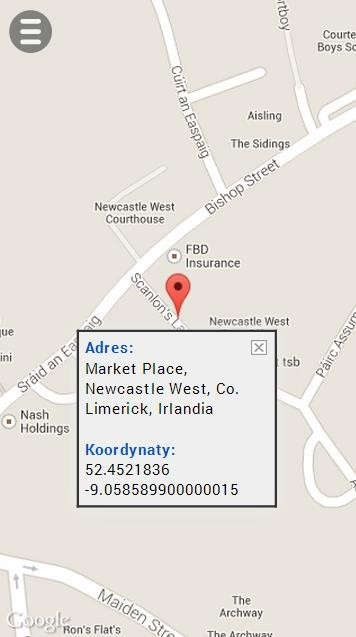

### 2.1.5 Fetching address

This functionality may become useful if we visited some place within selected territory, but we don't remember the exact address. We enable fetching addresses pressing the grey button, shown below:

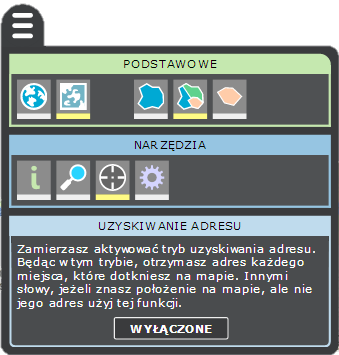

After pressing the button menu will be closed. Now when we touch any place on the map, we will get information about it:

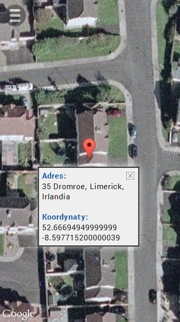

If we want to disable fetching addresses we need to go back to the menu > fetching addresses and press the button:

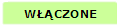

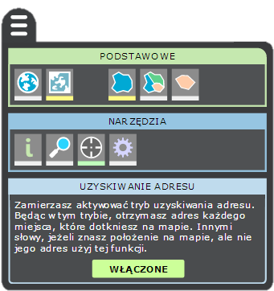

### 2.1.6 Settings

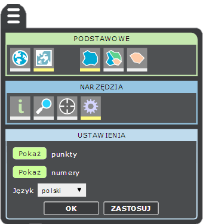

There are three settings:
- show / hide address markers:

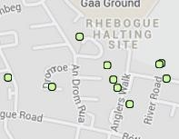

- show / hide regions numbers:

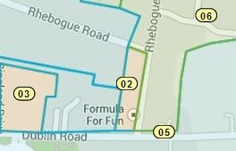

- change language: polish / english
