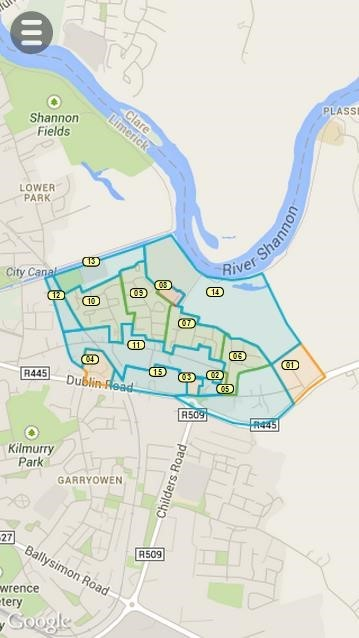
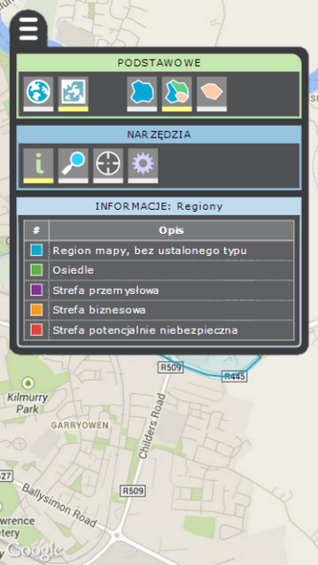
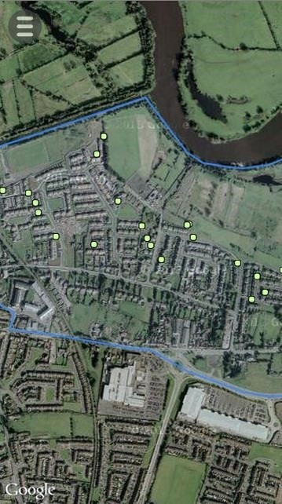
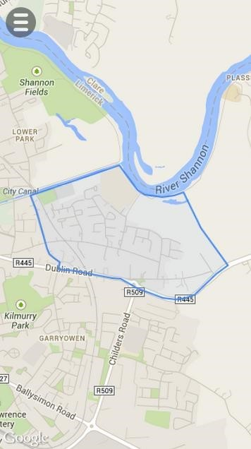
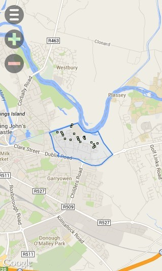
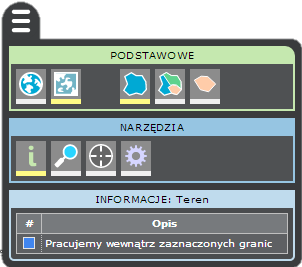
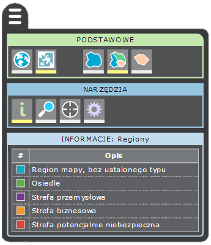
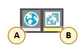
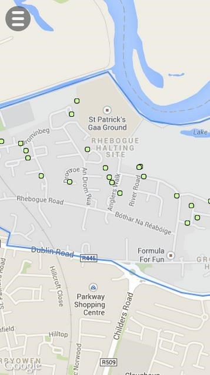

 

JavaScript application allowing to see KML polygons on Google Maps

# 1. Launching application

In order to launch the application you need to have QR code reader application (for example QRDroid on Android). After scanning given QR code, URL will be decoded. After visiting such URL, you will have application opened in your browser:

# 2. GUI

GUI consist of:
- div, which loads Google Maps with polygons and markers:

 
  
- menu button, which opens menu:

 

- plus / minus button, if your phone does not support multitouch for zooming in / out:

## 2.1 Menu

  

### 2.1.1 Map type

We can select **A** - satelite map or **B** - road map:

